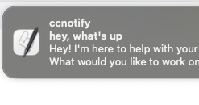

# ccnotify

[](https://github.com/foxytanuki/ccnotify/actions/workflows/ci.yml)
[](https://badge.fury.io/js/ccnotify)
[](https://opensource.org/licenses/MIT)



A CLI tool for creating Claude Code Stop Hooks with Discord, ntfy, and macOS notifications.

[日本語ドキュメントはこちら](./docs/ja/index.md)

## Overview

`ccnotify` simplifies the creation of Stop Hooks for Claude Code by automatically generating or updating the configuration file (`.claude/settings.local.json` for local projects or `~/.claude/settings.json` for global settings). This eliminates the manual process of writing hook configurations and provides a streamlined way to set up notifications when Claude Code operations complete.

## Features

- **Discord Notifications**: Send rich embed notifications to Discord webhooks
- **ntfy Push Notifications**: Send push notifications through ntfy.sh service
- **macOS Native Notifications**: Display native macOS notifications with sound
- **Global Configuration**: Support for both local and global configuration modes
- **Safe Configuration Management**: Preserves existing settings and creates backups
- **Cross-Platform**: Works on macOS, Linux, and Windows

## Installation

### ⚠️ Important: Git Security

**It is strongly recommended to add `.claude/settings.local.json` to your `.gitignore` file** to prevent accidentally committing sensitive information such as:
- Discord webhook URLs containing tokens
- Personal notification preferences
- Other potentially sensitive configuration data

Add this line to your `.gitignore`:
```gitignore
# Claude Code local settings (may contain sensitive data)
.claude/settings.local.json
```

### Using npx (Recommended)

Always use the latest version without global installation:

```bash
npx ccnotify discord https://discord.com/api/webhooks/123/abc
npx ccnotify ntfy my-topic
npx ccnotify macos "Notification Title"
```

### Global Installation

If you prefer to install globally:

#### Using npm

```bash
npm install -g ccnotify
```

#### Using yarn

```bash
yarn global add ccnotify
```

#### Using pnpm

```bash
pnpm add -g ccnotify
```

### From Source

```bash
git clone https://github.com/foxytanuki/ccnotify.git
cd ccnotify
pnpm install
pnpm run build
pnpm link --global
```

## Usage

### Quick Start with npx

```bash
# Discord notifications
npx ccnotify discord https://discord.com/api/webhooks/123456789/your-webhook-token

# ntfy notifications
npx ccnotify ntfy my-topic-name

# macOS notifications
npx ccnotify macos "Claude Code Completed"

# Global configuration
npx ccnotify discord https://discord.com/api/webhooks/123/abc --global
```

### Basic Commands

#### Discord Notifications

Create a Discord webhook notification hook:

```bash
ccnotify discord https://discord.com/api/webhooks/123456789/your-webhook-token
```

#### ntfy Push Notifications

Create an ntfy push notification hook:

```bash
ccnotify ntfy my-topic-name
```

#### macOS Native Notifications

Create a macOS native notification hook:

```bash
# Use default title (script will use "Claude Code")
ccnotify macos

# Use custom title
ccnotify macos "My Custom Title"
```

#### Notification Logging

View and manage notification logs:

```bash
# View recent logs
ccnotify logs

# Show only failed notifications
ccnotify logs --failed

# View statistics
ccnotify logs --stats

# Export logs to file
ccnotify logs --export logs.json

# Filter by notification type
ccnotify logs --type discord
ccnotify logs --type ntfy
ccnotify logs --type macos
```

#### Configuration Management

Manage notification logging settings:

```bash
# Show current configuration
ccnotify config --show

# Enable debug logging
ccnotify config --log-level DEBUG

# Include transcript content in logs
ccnotify config --include-transcripts
```

### Global Configuration

Use the `--global` or `-g` flag to create hooks in your global Claude configuration (`~/.claude/settings.json`):

```bash
ccnotify discord https://discord.com/api/webhooks/123/abc --global
ccnotify ntfy my-topic --global
ccnotify macos "Global Notifications" --global
```

### Help and Version

```bash
# Show help
ccnotify --help
ccnotify discord --help
ccnotify ntfy --help
ccnotify macos --help

# Show version
ccnotify --version
```

## Configuration

### Local vs Global

- **Local**: Creates/updates `.claude/settings.local.json` in the current directory
- **Global**: Creates/updates `~/.claude/settings.json` in your home directory

### Configuration File Structure

The tool creates Stop Hooks in your Claude configuration file and generates executable shell scripts in the XDG data directory:

```json
{
  "hooks": {
    "Stop": [
      {
        "matcher": "discord-notification",
        "hooks": [
          {
            "type": "command",
            "command": "/home/user/.local/share/ccnotify/discord-notification.sh"
          }
        ]
      }
    ]
  }
}
```

### Dynamic Configuration

All generated scripts support dynamic configuration through command arguments:

#### Discord
```bash
# Use default webhook URL embedded in script
/path/to/discord-notification.sh

# Override webhook URL dynamically
/path/to/discord-notification.sh "https://discord.com/api/webhooks/123/abc"

# In Claude settings.json
"command": "/path/to/discord-notification.sh https://discord.com/api/webhooks/123/abc"
```

#### ntfy
```bash
# Use default topic embedded in script
/path/to/ntfy-notification.sh

# Override topic dynamically
/path/to/ntfy-notification.sh "my-custom-topic"

# Also supports NTFY_TOPIC environment variable
NTFY_TOPIC="my-topic" /path/to/ntfy-notification.sh
```

#### macOS
```bash
# Use default title embedded in script
/path/to/macos-notification.sh

# Override title dynamically
/path/to/macos-notification.sh "Custom Title"

# In Claude settings.json
"command": "/path/to/macos-notification.sh \"My Custom Title\""
```

#### XDG Base Directory Support

ccnotify follows the XDG Base Directory Specification for configuration and data storage:

- **Executable scripts**: `$XDG_DATA_HOME/ccnotify/` (default: `~/.local/share/ccnotify/`)
- **Notification logs**: `$XDG_DATA_HOME/ccnotify/` (default: `~/.local/share/ccnotify/`)

You can customize these locations using environment variables:
- `XDG_CONFIG_HOME`: Custom configuration directory
- `XDG_DATA_HOME`: Custom data directory

### ⚠️ Important: Git Security

**It is strongly recommended to add `.claude/settings.local.json` to your `.gitignore` file** to prevent accidentally committing sensitive information such as:
- Discord webhook URLs containing tokens
- Personal notification preferences
- Other potentially sensitive configuration data

Add this line to your `.gitignore`:
```gitignore
# Claude Code local settings (may contain sensitive data)
.claude/settings.local.json
```

## Notification Types

### Discord

- Sends rich embed notifications with:
  - Operation completion title
  - User message as description
  - Assistant response as a field
  - Timestamp
  - Color coding

### ntfy

- Sends push notifications with:
  - User message as title
  - Assistant response as body (truncated to 500 chars)
  - Supports custom topic names

### macOS

- Displays native macOS notifications with:
  - Custom or default title
  - User message as subtitle
  - Assistant response as body
  - System sound (Pop.aiff)

## Requirements

- Node.js 20.0.0 or higher
- Claude Code installed and configured
- For Discord: Valid Discord webhook URL
- For ntfy: Valid topic name (alphanumeric, hyphens, underscores)
- For macOS: macOS system with notification permissions

## Examples

### Complete Workflow

```bash
# Set up Discord notifications for current project
ccnotify discord https://discord.com/api/webhooks/123456789/your-token

# Add ntfy notifications as well
ccnotify ntfy my-project-notifications

# Add macOS notifications with custom title
ccnotify macos "Project Notifications"

# Set up global notifications for all projects
ccnotify discord https://discord.com/api/webhooks/987654321/global-token --global
```

### Webhook URL Format

Discord webhook URLs should follow this format:
```
https://discord.com/api/webhooks/{webhook_id}/{webhook_token}
```

### ntfy Topic Names

Topic names should be:
- Alphanumeric characters
- Hyphens and underscores allowed
- No spaces or special characters

## Troubleshooting

### Common Issues

1. **Permission Denied**: Ensure you have write permissions to the target directory
2. **Invalid Webhook URL**: Verify your Discord webhook URL is correct
3. **Invalid Topic Name**: Use only alphanumeric characters, hyphens, and underscores
4. **JSON Parse Error**: Existing configuration file may be corrupted (backup will be created)

### Error Messages

The tool provides clear error messages for common issues:
- Invalid webhook URLs
- Invalid topic names
- File permission errors
- JSON parsing errors

### Backup and Recovery

The tool automatically creates backups of existing configuration files before making changes. Backups are stored with timestamps:
- `.claude/settings.local.json.backup.YYYY-MM-DDTHH-MM-SS-sssZ` (for local configurations)
- `~/.claude/settings.json.backup.YYYY-MM-DDTHH-MM-SS-sssZ` (for global configurations)

### Notification Logging

When notifications don't work as expected, use the built-in logging system to diagnose issues:

```bash
# View recent notification logs
ccnotify logs

# Show only failed notifications
ccnotify logs --failed

# View statistics
ccnotify logs --stats

# Export logs for analysis
ccnotify logs --export logs.json

# Filter by notification type
ccnotify logs --type discord
ccnotify logs --type ntfy
ccnotify logs --type macos
```

Logs are automatically saved to `$XDG_DATA_HOME/ccnotify/notifications.log` (default: `~/.local/share/ccnotify/notifications.log`) and include:
- Execution timestamps
- Success/failure status
- HTTP response codes
- Execution times
- Error messages
- Configuration details (with sensitive data masked)

#### Script Management

The generated shell scripts are stored in `$XDG_DATA_HOME/ccnotify/` and are automatically made executable. These scripts handle:
- Transcript parsing and message extraction
- Notification formatting and sending
- Error handling and logging
- Cross-platform compatibility

## Development

### Building from Source

```bash
git clone https://github.com/foxytanuki/ccnotify.git
cd ccnotify
pnpm install
pnpm run build
```

### Running Tests

```bash
pnpm test
pnpm run test:coverage
```

### Development Mode

```bash
pnpm run dev -- discord https://example.com/webhook
```

## Contributing

1. Fork the repository
2. Create a feature branch
3. Make your changes
4. Add tests for new functionality
5. Run the test suite
6. Submit a pull request

## License

MIT License - see [LICENSE](LICENSE) file for details.

## Support

For issues and questions:
- GitHub Issues: https://github.com/foxytanuki/ccnotify/issues
- Documentation: https://github.com/foxytanuki/ccnotify/wiki

## Changelog

### v0.1.0
- Add notification logging system with `logs` and `config` commands
- Add XDG Base Directory support for script and log storage
- Improve message handling with proper JSON encoding
- Add comprehensive test coverage
- Update Node.js requirement to v20.0.0+

### v0.0.3
- Update docs

### v0.0.1 & v0.0.2
- Initial release
- Discord webhook notifications
- ntfy push notifications
- macOS native notifications
- Global and local configuration support
- Comprehensive error handling and validation
