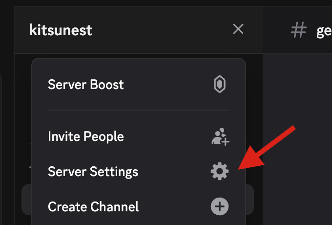
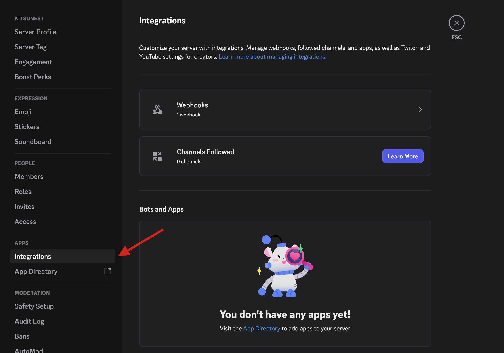
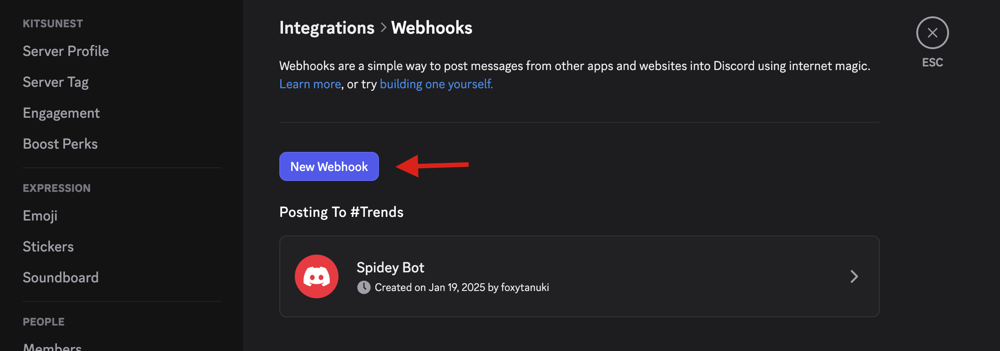
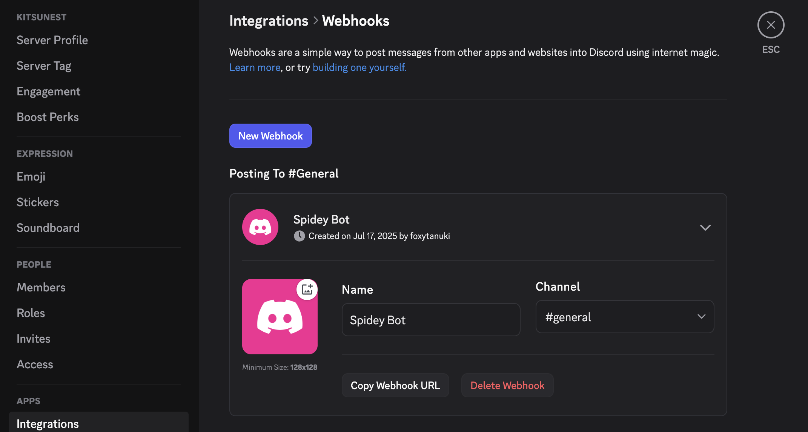
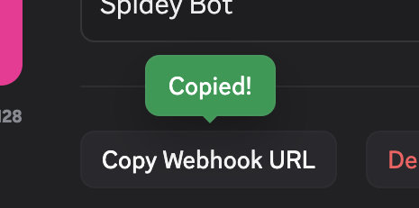

# Discord Webhook URLの取得方法

## 概要

ccnotifyでDiscord通知を使用するには、Discord WebhookのURLが必要です。このガイドでは、Discord Webhook URLの取得方法を説明します。
なお、サーバーの管理権限が必要です。

## 手順

### 1. Discordサーバーの設定を開く

Discord通知を送信したいチャンネルがあるサーバーで、以下の手順を実行します。

1. サーバー名の横にある「▼」をクリック
2. 「サーバー設定」を選択

<!-- スクリーンショット: Discordサーバーメニューからサーバー設定を選択している画面 -->


### 2. 連携サービス（Integrations）を開く

左側のメニューから「連携サービス」（英語版では「Integrations」）をクリックします。

<!-- スクリーンショット: サーバー設定の左メニューで「連携サービス」を選択している画面 -->


### 3. ウェブフックを作成

1. 「ウェブフック」セクションを見つける
2. 「ウェブフックを作成」ボタンをクリック

<!-- スクリーンショット: 連携サービス画面でウェブフックセクションと作成ボタンが表示されている画面 -->


### 4. ウェブフックの設定

1. **名前**: ウェブフックの名前を設定（例：「Claude Code Notifications」）
2. **チャンネル**: 通知を送信したいチャンネルを選択
3. **アバター**: 必要に応じてアバター画像を設定

<!-- スクリーンショット: ウェブフック設定画面で名前とチャンネルを設定している画面 -->



### 5. ウェブフックURLをコピー

1. 「ウェブフックURLをコピー」ボタンをクリック
2. URLがクリップボードにコピーされます

<!-- スクリーンショット: ウェブフックURL欄とコピーボタンが表示されている画面（URLは部分的にぼかす）-->



### 6. ccnotifyで使用

コピーしたURLを使用してccnotifyを設定します：

```bash
ccnotify discord https://discord.com/api/webhooks/123456789/your-webhook-token
```

## セキュリティに関する注意事項

- **Webhook URLは機密情報**：URLを知っている人は誰でもそのチャンネルにメッセージを送信できます
- **公開リポジトリにコミットしない**：設定ファイル(`.claude/settings.local.json`)は、`.gitignore`に追加してください
- **定期的に再生成**：セキュリティのため、定期的にWebhookを削除して新しいものを作成することをお勧めします

## トラブルシューティング

### Webhookが作成できない場合

- サーバーの管理権限が必要です
- サーバーオーナーまたは管理者に権限を付与してもらってください

### 通知が届かない場合

1. URLが正しくコピーされているか確認
2. チャンネルの権限設定を確認
3. Discordのステータスページで障害が発生していないか確認

## 関連リンク

- [Discord Developer Documentation - Webhooks](https://discord.com/developers/docs/resources/webhook)
- [ccnotify README](../README.md)
