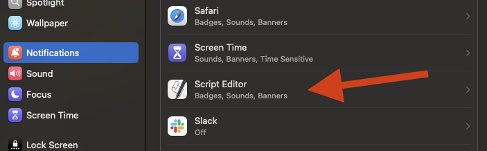

# macOS通知の設定ガイド

## 概要

ccnotifyのmacOS通知機能は、`osascript`（AppleScript）を使用してネイティブな通知を表示します。初回設定時には、macOSの通知設定に表示されるようにするため、Script Editorでテスト通知を送信する必要があります。

## 重要：初回設定の手順

### なぜScript Editorでのテストが必要か

macOSのセキュリティ機能により、`osascript`コマンドを使用する通知は、最初にScript Editor経由で実行しないと、システム環境設定の「通知とフォーカス」に表示されません。これは、ccnotifyが正常に動作するために必要な手順です。

## セットアップ手順

### 1. Script Editorを開く

1. Finderを開く
2. アプリケーション > ユーティリティ > スクリプトエディタ.app を起動
   - または、Spotlight検索（⌘ + Space）で「Script Editor」と入力

<!-- スクリーンショット: Script Editorアプリのアイコンと起動画面 -->


### 2. テストスクリプトを作成

左下の「新規ドキュメント」を選択


Script Editorに以下のAppleScriptを入力します：

```applescript
display notification "ccnotify"
```

<!-- スクリーンショット: Script Editorにコードを入力した画面 -->


### 3. スクリプトを実行

1. 右上の実行ボタン（▶️）をクリック
2. 初回実行時は、通知の許可を求められる場合があります
3. 「許可」をクリック

<!-- スクリーンショット: Script Editorの実行ボタンと、通知許可のダイアログ -->


### 4. 通知設定を確認

1. システム環境設定を開く（ メニュー > システム環境設定）
2. 「通知とフォーカス」をクリック
3. 左側のアプリリストに「Script Editor」が表示されることを確認

<!-- スクリーンショット: システム環境設定の通知とフォーカスでScript Editorが表示されている画面 -->
設定できたら、以下のような通知が表示されます。



### 5. 通知を有効化

Script Editorの通知設定で以下を確認：

- **通知を許可**: オン
- **通知スタイル**: バナーまたは通知パネル

<!-- スクリーンショット: Script Editorの通知設定画面 -->

設定できたら、以下のような通知が表示されます!


### 6. ccnotifyを設定

ターミナルで以下のコマンドを実行：

```bash
# デフォルトのタイトルで設定
ccnotify macos

# カスタムタイトルで設定
ccnotify macos "開発完了通知"

# グローバル設定
ccnotify macos --global
```

## 動作確認

### テスト方法

1. ccnotifyの設定が完了したら、Claude Codeで簡単な操作を実行 (`claude hi`など)
2. 操作完了時に通知が表示されることを確認

### 通知の内容

macOS通知には以下の情報が表示されます：

- **タイトル**: 設定したタイトル（デフォルト: "Claude Code"）
- **サブタイトル**: ユーザーのメッセージ（最大256文字）
- **本文**: アシスタントの応答（最大1000文字）
- **サウンド**: Pop.aiff（システムサウンド）

<!-- スクリーンショット: 実際のmacOS通知の表示例 -->

## トラブルシューティング

### 通知が表示されない場合

1. **Script Editorでのテストを再実行**
   ```applescript
   display notification "テスト" with title "テスト"
   ```

2. **ターミナルアプリの通知権限を確認**
   - システム環境設定 > 通知とフォーカス
   - 使用しているターミナルアプリ（Terminal.app、iTerm2など）の通知も有効化

3. **おやすみモードの確認**
   - コントロールセンターでおやすみモードがオフになっているか確認

4. **コマンドラインから直接テスト**
   ```bash
   osascript -e 'display notification "テスト通知" with title "ccnotify"'
   ```

### 音が鳴らない場合

1. **システムサウンドの確認**
   ```bash
   # サウンドファイルの存在確認
   ls /System/Library/Sounds/Pop.aiff

   # サウンドを直接再生してテスト
   afplay /System/Library/Sounds/Pop.aiff
   ```

2. **通知設定でサウンドが有効か確認**
   - システム環境設定 > 通知とフォーカス > Script Editor > サウンド

3. **システム音量とミュート設定を確認**

### セキュリティとプライバシー

macOS通知は完全にローカルで動作し、外部サービスとの通信は行いません。通知の内容はmacOSの通知センターに一時的に保存されますが、機密情報が含まれる場合は注意してください。

## よくある質問

### Q: なぜScript Editorでの初回設定が必要なのですか？

A: macOSのセキュリティ機能により、`osascript`を使用する通知は、信頼されたアプリケーション（Script Editor）から最初に実行する必要があります。これにより、システムが通知の送信元を認識し、通知設定に表示されるようになります。

### Q: 毎回Script Editorでテストする必要がありますか？

A: いいえ、初回設定時のみです。一度設定が完了すれば、ccnotifyは正常に通知を送信できます。

### Q: 複数のMacで使用する場合は？

A: 各Macで初回設定（Script Editorでのテスト）を行う必要があります。設定はデバイスごとに独立しています。

### Q: 通知の履歴はどこで確認できますか？

A: macOSの通知センター（画面右上の時計をクリック）で過去の通知を確認できます。

## 関連リンク

- [ccnotify README](../../README.md)
