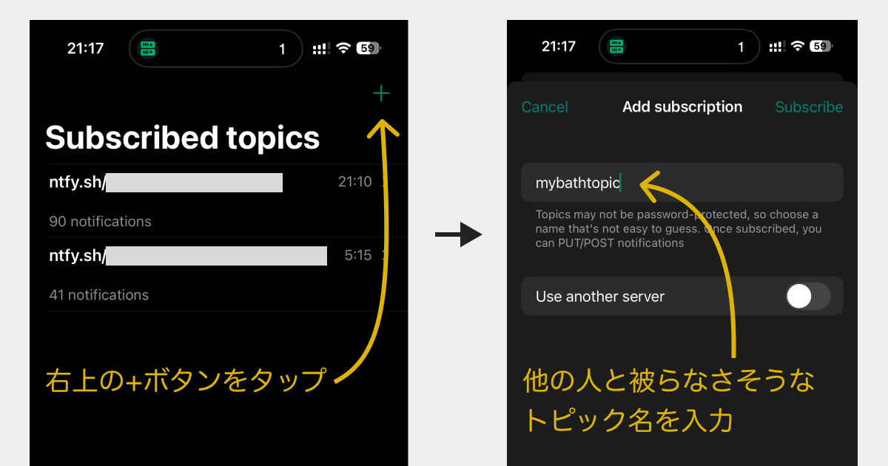

# ntfy.shの使い方とトピック設定

## 概要

ntfy.shは、HTTP PUTまたはPOSTリクエストを介してプッシュ通知を送信できる、シンプルなHTTPベースの通知サービスです。ccnotifyでは、ntfy.shを使用してモバイルデバイスやデスクトップに通知を送信できます。

## ntfy.shとは

- **無料**で使用可能（セルフホストも可能）
- **アカウント不要**（パブリックトピックの場合）
- **マルチプラットフォーム対応**：Android、iOS、Web、デスクトップ
- **シンプル**：HTTPリクエストだけで通知送信

## セットアップ手順

### 1. ntfyアプリのインストール

#### モバイル

<!-- スクリーンショット: Google PlayストアまたはApp Storeでntfyアプリを検索している画面 -->

- **Android**: [Google Play Store](https://play.google.com/store/apps/details?id=io.heckel.ntfy)
- **iOS**: [App Store](https://apps.apple.com/app/ntfy/id1625396347)

#### デスクトップ

- **Web**: https://ntfy.sh/

### 2. トピック名の決定

トピック名は、通知を受信するための「チャンネル」のようなものです。
トピック名を知られていると他の人にメッセージを見られてしまうので、なるべく推測されにくい名前を選びましょう。

**良いトピック名の例：**
- `claude-code-alerts-Sd29aldsg8` (識別名 +　ランダム文字列)
- `my-project-6D9CDE44-90B4-4674-B25F-48B4F7DC6FF6` (識別名 + UUID)
- `D7BA3C63-44D7-4483-BC43-CA5BABDB3FA3` (UUID)

### 3. アプリでトピックを購読

#### モバイルアプリの場合

1. ntfyアプリを開く
2. 「＋」ボタンをタップ
3. トピック名を入力（例：`my-project-notifications`）
4. 「Subscribe」をタップ

<!-- スクリーンショット: ntfyアプリでトピックを追加する画面 -->


#### Webブラウザの場合

1. https://ntfy.sh/ にアクセス
2. 右上の「Subscribe to topic」をクリック
3. トピック名を入力
4. 「Subscribe」をクリック

<!-- スクリーンショット: ntfy.sh Webサイトでトピックを購読する画面 -->

### 4. ccnotifyで設定

```bash
ccnotify ntfy my-project-notifications
```

### 5. テスト通知の送信

設定が正しく動作するか確認するには：

```bash
# 手動でテスト通知を送信
curl -d "テスト通知です" ntfy.sh/my-project-notifications
```

## プライベートトピックの使用（推奨）

セキュリティを強化するため、[有料プラン](https://ntfy.sh/#pricing)では認証付きのプライベートトピックを使用できます。


## セルフホスティング

より高いセキュリティとプライバシーが必要な場合、ntfyサーバーを自分でホストできます。

```bash
# Dockerを使用した例
docker run -p 80:80 -v /var/cache/ntfy:/var/cache/ntfy binwiederhier/ntfy serve
```

詳細は[ntfy公式ドキュメント](https://docs.ntfy.sh/install/)を参照してください。

## トラブルシューティング

### 通知が届かない場合

1. **トピック名の確認**: 大文字小文字を含めて正確に一致しているか確認
2. **ネットワーク接続**: インターネット接続を確認
3. **通知権限**: デバイスの通知設定を確認

## 関連リンク

- [ntfy公式サイト](https://ntfy.sh/)
- [ntfy Documentation](https://docs.ntfy.sh/)
- [ccnotify README](../README.md)
